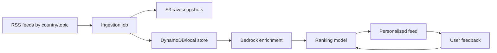

# AI News Intelligence Platform

A portfolio MVP for explainable personalized news recommendations. The app demonstrates the full loop:



## What Works

- Topic and country onboarding.
- Settings page for changing topics and countries later.
- Country-aware article cards and explanations.
- Pure TypeScript ranking model with cold-start behavior.
- Feedback controls: more like this, less like this, save, hide source, mute topic.
- RSS ingestion script and dev admin route.
- Bedrock enrichment module with local fallback for demos.
- AWS CDK stack for S3, DynamoDB, Lambda, EventBridge, IAM, and Cognito.

## Local Setup

```bash
npm install
npm run seed-demo-data
npm run dev
```

Open `http://localhost:3000`.

## Scripts

- `npm run seed-demo-data`: resets local `.data/news-store.json` with realistic multi-country demo data.
- `npm run ingest`: fetches configured RSS feeds and stores normalized article records locally.
- `npm run enrich`: enriches pending articles. Set `ENABLE_BEDROCK=true` to call Bedrock; otherwise it uses deterministic local fallback.
- `npm test`: runs ranking and ingestion unit tests.
- `npm run cdk synth`: synthesizes the AWS infrastructure template.

## Ranking

Normal score:

```txt
0.30 topicMatch +
0.20 semanticSimilarity +
0.15 countryMatch +
0.15 recency +
0.10 feedback +
0.05 sourceDiversity +
0.05 popularity
```

Cold start applies until 5 interactions:

```txt
0.45 topicMatch +
0.35 countryMatch +
0.15 recency +
0.05 sourceDiversity
```

Hard filters remove hidden sources, muted topics, disliked articles, and failed enrichments.

## Cost Controls

- Development ingestion is capped by `INGEST_MAX_ARTICLES`, default `200`.
- Articles are deduplicated by canonical URL hash before enrichment.
- Enrichment is cached with `enriched=true`.
- Bedrock is disabled by default locally.
- Text enrichment uses a Haiku-family model ID from `BEDROCK_TEXT_MODEL_ID`.
- Embeddings use `amazon.titan-embed-text-v2:0`.
- No vector DB is used for MVP scale; cosine similarity is computed in-process.

## AWS Deployment Notes

The CDK stack creates the portfolio-ready resource baseline, but the included ingestion Lambda is intentionally a placeholder. For a production deploy, bundle `lib/news/ingest.ts` and `lib/news/enrich.ts` into Lambda handlers, then enable the EventBridge rule.

```bash
npm run cdk synth
npm run cdk deploy
```

## Next Steps

- Replace local JSON persistence with a DynamoDB repository implementation.
- Add OpenSearch Serverless k-NN after article volume grows beyond in-process ranking.
- Add Amazon Personalize or A/B tests once enough interaction data exists.
- Enable Cognito in the app shell for real multi-user deployment.
