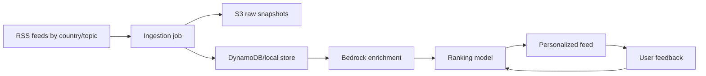

# AI News Intelligence Platform

A portfolio MVP for explainable personalized news recommendations. The app demonstrates the full loop:



## What Works

- Topic and country onboarding.
- Settings page for changing topics and countries later.
- Country-aware article cards and explanations.
- Pure TypeScript ranking model with cold-start behavior.
- Feedback controls: more like this, less like this, save, hide source, mute topic.
- RSS ingestion script and dev admin route.
- Bedrock enrichment module with local fallback for demos.
- AWS CDK stack for S3, DynamoDB, bundled Lambda workers, EventBridge, IAM, and Cognito.

## Local Setup

```bash
npm install
npm run seed-demo-data
npm run dev
```

Open `http://localhost:3000`.

## Scripts

- `npm run seed-demo-data`: resets local `.data/news-store.json` with realistic multi-country demo data.
- `npm run ingest`: fetches configured RSS feeds and stores normalized article records in the active store.
- `npm run enrich`: enriches pending articles. Set `ENABLE_BEDROCK=true` to call Bedrock; otherwise it uses deterministic local fallback.
- `npm test`: runs ranking and ingestion unit tests.
- `npm run cdk synth`: synthesizes the AWS infrastructure template.

## Storage Backends

The app defaults to local JSON storage for a fast demo. Set `STORAGE_BACKEND=aws` plus the CDK outputs below to run the same app/API/scripts against DynamoDB and S3:

```bash
STORAGE_BACKEND=aws
NEWS_TABLE_NAME=<NewsTableName output>
RAW_ARTICLES_BUCKET=<RawArticlesBucketName output>
AWS_REGION=us-east-1
```

## Ranking

Normal score:

```txt
0.30 topicMatch +
0.20 semanticSimilarity +
0.15 countryMatch +
0.15 recency +
0.10 feedback +
0.05 sourceDiversity +
0.05 popularity
```

Cold start applies until 5 interactions:

```txt
0.45 topicMatch +
0.35 countryMatch +
0.15 recency +
0.05 sourceDiversity
```

Hard filters remove hidden sources, muted topics, disliked articles, and failed enrichments.

## Cost Controls

- Development ingestion is capped by `INGEST_MAX_ARTICLES`, default `200`.
- Articles are deduplicated by canonical URL hash before enrichment.
- Enrichment is cached with `enriched=true`.
- Bedrock is disabled by default locally.
- Text enrichment uses a Haiku-family model ID from `BEDROCK_TEXT_MODEL_ID`.
- Embeddings use `amazon.titan-embed-text-v2:0`.
- No vector DB is used for MVP scale; cosine similarity is computed in-process.

## AWS Deployment Notes

The CDK app defines **two stacks**:

1. **`NewsRecommenderStack`** — DynamoDB, S3 raw bucket, Cognito, ingest + enrich Lambdas, optional EventBridge schedules.
2. **`RapidReadWebStack`** — Next.js on **AWS Lambda** (OpenNext) with a **CloudFront** distribution in front of static assets and server function URLs.

RapidRead data Lambdas:

- `IngestionFunction`: fetches RSS feeds, deduplicates by canonical URL, writes raw snapshots to S3, and stores article metadata in DynamoDB.
- `EnrichmentFunction`: scans pending articles, calls Bedrock for summary/topics/entities/sentiment and Titan embeddings, then updates DynamoDB.

EventBridge schedules are created disabled by default to avoid surprise Bedrock cost. Enable them during synth/deploy with `-c enableSchedules=true`.

### Deploy backend + website (Lambda + CloudFront)

From the repo root (after `npm install` and [CDK bootstrap](https://docs.aws.amazon.com/cdk/v2/guide/bootstrapping.html) in your account/region):

```bash
npm run cdk:deploy
```

That runs `next build`, `open-next build` (writes `.open-next/`), then `cdk deploy --all` for both stacks. The web stack grants the Next.js server Lambda read/write to the news table and raw bucket; `SiteUrl` in **RapidReadWebStack** outputs the CloudFront URL.

Other commands:

```bash
npm run build:open-next   # production Next.js + OpenNext bundle only
npm run cdk synth
npm run cdk deploy -- --all
npm run cdk deploy -- --all -c enableSchedules=true
```

### Outputs

**NewsRecommenderStack:** `NewsTableName`, `RawArticlesBucketName`, `UserPoolId`, `UserPoolClientId`, `IngestionFunctionName`, `EnrichmentFunctionName`.

**RapidReadWebStack:** `SiteUrl`, `DistributionId`.

## Next Steps

- Add OpenSearch Serverless k-NN after article volume grows beyond in-process ranking.
- Add Amazon Personalize or A/B tests once enough interaction data exists.
- Enable Cognito in the app shell for real multi-user deployment.
